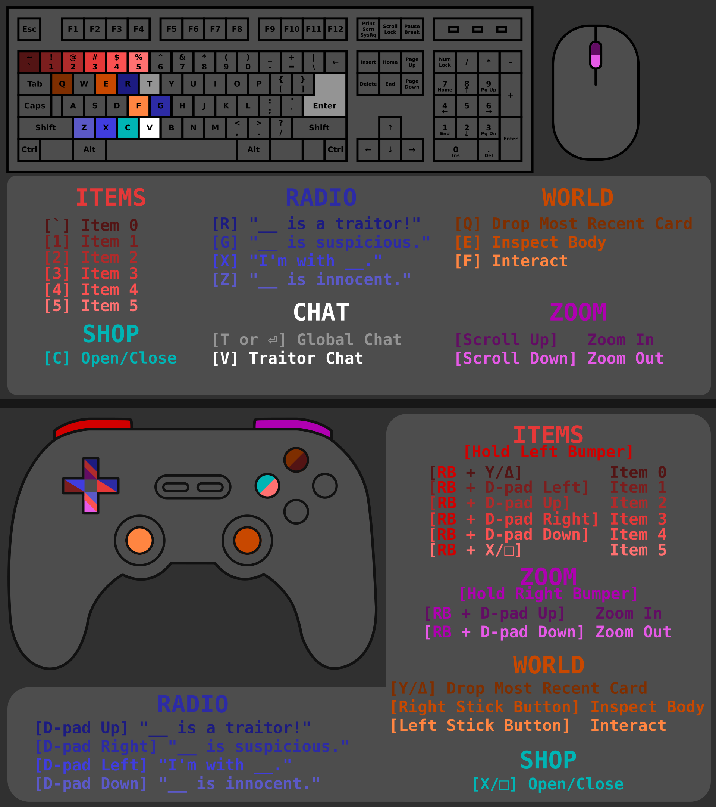

# Trouble In ROUNDS Town
### By Pykess

---

## Table of Contents

1. [Introduction](#introduction)
2. [Quick Reference](#quick-reference)
3. [Controls](#controls)
4. [Gameplay](#gameplay)
    1. [Winning](#winning)
    2. [Death](#death)
    3. [Rounds](#rounds)
    4. [Chat](#chat)
    5. [Karma](#karma)
    6. [Item Shops](#item-shops)
        - [Items](#items)
        - [Credits](#credits)
    7. [Quickchat / Radio](#quickchat-%2F-radio)
5. [Roles](#roles)
    - [Classic](#classic)
        - 
        - 
        - 
    - [Chaos](#chaos)
        - 
        - 
    - [Additional Innocent Roles](#additional-innocent-roles)
        - 
        - 
        - 
    - [Additional Traitor Roles](#additional-traitor-roles)
        - 
        - 
        - 
        - 
    - [Killer](#killer)
        - 

---

## Introduction

Trouble In ROUNDS Town (TRT) is a role-playing game mode where some players are "traitors" and some are "innocent." The traitors' goal is to eliminate all of the non-traitors. The innocents' goal is to figure out who the traitors are, and then kill them.

***This game is very different from normal ROUNDS: random killing is against both the spirit of the game and the rules. There are in-game systems to punish random killing, discussed later in this document.***

This game mode is a near-exact one-to-one port of [TTT from Gary's Mod](https://www.troubleinterroristtown.com/). So if you've played TTT, lots of this will be familiar.

## Quick Reference

This section is a quick reference for if you already know how to play and just need the quick facts. The rest of this document provides a detailed guide on how to play.

- Every round has a 30 second preparation phase during which players can collect cards from around the map (default control: "F" or left stick button) and explore.
- Every round players' roles are randomly determined
- **_Dead players cannot communicate with alive players by any means. This includes external voice chat._**
- Detectives, Traitors, Mercenaries, Killers, and Zombies all have access to a shop.
- Players can pick up cards at any time during a round (default control: "F" or left stick button)
- Players can have a maximum of 2 cards. Custom cards bought in a shop do not count.
- Players can discard their most recent card (default control: "Q" or Y/Δ) or any card by clicking on it in the card bar.
- Killing teammates causes you to lose karma. This will negatively effect the amount of damage you do in future rounds.
- Players gain karma each round they complete without team-killing.
- If a player's karma drops too low, they will be automatically killed at the end of the next preparation phase.
- Players can inspect bodies (default control: "E" or right stick button).
- Players can zoom in and out (default control: scroll wheel or right bumper + D-pad up/down). The maximum zoom a player can use is determined by their gun's projectile speed stat.

## Controls

## Gameplay

TRT takes place with a group of players, some of whom are traitors. The traitors know who is a traitor and who isn't, **but innocent players do *not* know who is a traitor or who is innocent.**

At the start of each round, some players are randomly selected to be traitors. There will always be at least one traitor. Traitors are notified that they have been selected, and the clock/role display in the upper left will display this as well.

Additionally, a small number of innocent players will be selected to be a **detective**. Detectives are _always_ innocent and everyone can see who the detectives are. Detectives have special abilities and access to a shop to help the innocents against the traitors.

**Innocent players will always make up the majority.** To overcome their numbers disadvantage, the traitors must leverage the fact that their identities are initially secret. Additionally, traitors have access to a shop in which they can buy useful weapons and equipment.

### Cards

Vanilla ROUNDS cards are distributed around the map at set locations determined by the map itself. Modded cards are not enabled in TRT. Some vanilla cards are not enabled (e.g. Tank) for balance reasons.

Players can collect up to 2 cards at any point in the round by walking up to one and pressing "F" or left stick button by default. Players can discard their most recent card at any time by pressing "Q" or Y/Δ by default. Players may also discard any card in their hand by clicking on the card bar square (e.g. a player can discard "Spray" by clicking on the small "Sp" square in their card bar.)  Discarded cards are simply dropped where the player stands.

Some custom TRT cards cannot be discarded, usually because they are integral to the player's role.

When a player dies, all of their cards (except for certain custom TRT cards) will be dropped where they died, other players may then collect them if desired.

### Winning

Traitors win when all of the innocent players are dead.

Innocents win when all of the traitors are dead _or_ the time limit is reached and at least one innocent is still alive.

### Death

When a player dies, they can no longer talk to players who are still alive. They have a separate in-game chat reserved for dead players.

***If you are playing with a group in an external voice call, everyone must follow the rule that if you are dead, you cannot speak.***

When a player dies, no one is notified, no score is updated, nothing changes. Their body will stay on the map and can be found by other players. If another player finds their body, they can (and should!) identify it by walking up to it and inspecting it (default control: "E" or right stick button). This will announce to the entire server which player identified the body, whose body it was, and what role they were. If a detective inspects a body, it will reveal additional information for everyone such as how long ago the player died and the color of the last player that either they shot or shot them.

Dead players begin spectating the game but are still unable to see living players' roles, since there are circumstances where dead players can be revived.

### Rounds

Each round has two phases: **preparing** and **active** (or in-progress).

The preparation phase lasts 30 seconds, during which players can explore the map and collect cards (default control: "F" or left stick button). Players can shoot but cannot deal or take damage.

At the end of the preparation phase, the active phase starts. This is the phase where the actual gameplay takes place. All players are immediately assigned roles at random, and damage is enabled.

As soon as a role has won, a win screen is shown and the game moves on to the next round.

The game will repeat the same map as many times as the `NumberOfPointsPerRound` setting is set, by default this is 4.

### Chat

Players that are alive have access to a global chat (default control: "T" or "Enter"). Players that are dead cannot communicate with living players, but can still see their messages. This prevents spectators from revealing information.

Traitors have access to a traitor-only text chat (default control: "V"). Certain roles disable this chat for all traitors, and other roles have the ability to send, but not receive, messages in this chat.

***If your party is playing with an external voice chat (which is recommended) it is important that all players follow the rule that dead players cannot speak.***

### Karma

Karma is the built-in mechanism to punish team-killing (also called "random deathmatching" or "RDMing").

At the start of a new map, all players have perfect karma and are shown as `[Reputable]`. Team-killing reduces your karma. In descending order, the different karma levels are:
- `[Reputable]`
- `[Trigger Happy]`
- `[Crude]`
- `[Dangerous]`
- `[Liability]`

A player's karma directly translates to how much damage they deal. With perfect karma, they deal 100% of their normal damage, by the time they've reached `[Liability]` they will only deal 50% of their normal damage.

Karma is updated at the end of a round, that way it cannot be used to determine who is a traitor and who is not.

At the end of each round, if you are below perfect karma, you will regain karma if you did not team-kill during the round. You receive less karma if you are dead at the end of the round.

If a player's karma is too low, they will receive a "slay." Such a player will be automatically instantly killed at the end of the next preparation phase, _after_ their role has been assigned.

### Item Shops

Some roles (Traitors, Detectives, Mercenaries, Zombies, and Killers) have access to a shop (default control: "C" or X/□) where they can buy useful weapons and equipment. The number of credits a player spawns with, as well as the items available to them in the shop, are dependent on their role.

#### Items

Most TRT items are bound to a specific item button. The exact button each is tied to is denoted in the lower right corner of the card, as well as referenced in the card's description text somewhere (for example, `[item 4]`). The default controls for each of the item slots are shown below.

| Item      | Keyboard | Controller |
| ----------- | ----------- | ---------- |
| Item 0      | Backtick (`~`)       | Left bumper + Y/Δ |
| Item 1   | `1`        | Left bumper + D-pad left |
| Item 2   | `2`        | Left bumper + D-pad up |
| Item 3   | `3`        | Left bumper + D-pad right |
| Item 4   | `4`        | Left bumper + D-pad down |
| Item 5   | `5`        | Left bumper + X/□ |

Some items are passive and need not be activated with a key or button press.

Some items cannot be discarded, nor are they dropped when the player dies.

#### Credits

Some roles spawn with credits, others do not. Some roles can earn credits throughout the round, some cannot. For details on each specific role, see the Roles section.

### Quickchat / Radio

There are several radio shortcuts to help players communicate quickly. All of them make use of the closest player (denoted here as `<player>`). The quickchats and their default controls are listed below.

| Chat      | Keyboard | Controller |
| ----------- | ----------- | ---------- |
| "I'm with `<player>`."   | `X`        | D-pad left |
| "`<player>` is a traitor!"   | `R`        | D-pad up |
| "`<player>` is suspicious."   | `G`        | D-pad right |
| "`<player>` is innocent."      | `Z` | D-pad down |

# Roles

Below are the names and colors of each role. These images are links to each role's description later in the document.

## Classic

### <a name="innocent">
**Team: Innocent**

_Win condition: Kill all members of the traitor team or have at least one innocent alive when the timer runs out._

The most common role.

---
### <a name="traitor">
**Team: Traitor**

_Win condition: Kill all members of the innocent team._

- Has access to the traitor shop
    - Spawns with one credit
    - Receives an additional credit each time a certain portion of the innocent team has been killed
- Notified of all team members and **Jesters** at the start of the round
- Notified of the presence, but _not_ the identity, of a **Killer** if one spawns

---
### <a name="detective">

**Team: Innocent**

_Win condition: Kill all members of the traitor team or have at least one innocent alive when the timer runs out._

- Has access to the detective shop
    - Spawns with two credits
    - Receives an additional credit each time a member of the traitor team is killed
- **All players** are able to see the identity of the detective
- Can investigate bodies, which reveals additional information _to all players_ including
    - Approximately how long ago they died
    - The approximate color of the last player they shot
    - The approximate color of the last player that shot them

---
## Chaos

### <a name="jester">

**Team: None**

_Win condition: Be killed by another player._

- Deals no damage to other players
- Cannot take environment or self-inflicted damage
- Can send messages to the traitor team (default control: `V`) but cannot receive replies

---
### <a name="swapper">

**Team: None**

_Win condition: Be killed by another player, then fulfill the win condition of their role._

- Deals no damage to other players
- Cannot take environment or self-inflicted damage
- Can send messages to the traitor team (default control: `V`) but cannot receive replies
- Appears as a **Jester** to members of the traitor team
- When killed by another player, the **Swapper** assumes the role of their killer
    - The **Swapper** will immediately respawn with the new role
    - The player that killed the swapper will be killed instantly
    - If the body of their killer is searched, they will appear as a **Swapper**

---
## Additional Innocent Roles

### <a name="glitch">

**Team: Innocent**

_Win condition: Kill all members of the traitor team or have at least one innocent alive when the timer runs out._

- Appears as a **Traitor** to members of the traitor team (or a **Zombie**)
- Prevents members of the traitor team from using traitor chat until they are killed

---
### <a name="mercenary">

**Team: Innocent**

_Win condition: Kill all members of the traitor team or have at least one innocent alive when the timer runs out._

- Has access to a shop with _all_ weapons and equipment available to _both_ traitors and the **Detective**
    - Spawns with one credit

---
### <a name="phantom">

**Team: Innocent**

_Win condition: Kill all members of the traitor team or have at least one innocent alive when the timer runs out._

- When the **Phantom** is killed, they will haunt their killer
    - Haunted players constantly emit smoke
    - When the haunted player is killed, the **Phantom** will respawn with half health
    - **Detectives** are notified when the **Phantom** is killed or revived

---

## Additional Traitor Roles

### <a name="hypnotist">

**Team: Traitor**

_Win condition: Kill all members of the innocent team._

- Can revive one player by interacting (default control: `F` or left stick button)
    - The revived player will respawn as a **Traitor**
- Has access to the traitor shop
    - Spawns with zero credits
    - Receives an additional credit each time a certain portion of the innocent team has been killed
- Notified of all team members and **Jesters** at the start of the round
- Notified of the presence, but _not_ the identity, of a **Killer** if one spawns

---
### <a name="assassin">

**Team: Traitor**

_Win condition: Kill all members of the innocent team._

- Is given a target player at the beginning of the round
    - Deals double damage to the target player
    - Deals half damage to all other players
    - When the target dies a new target is assigned
    - Killing the wrong player will fail the contract and the **Assassin** will deal half damage to all players for the rest of the round
    - **Detectives** will always be the final targets
- Has access to the traitor shop
    - Spawns with zero credits
    - Receives an additional credit each time a certain portion of the innocent team has been killed
- Notified of all team members and **Jesters** at the start of the round
- Notified of the presence, but _not_ the identity, of a **Killer** if one spawns

---
### <a name="vampire">

**Team: Traitor**

_Win condition: Kill all members of the innocent team._

- Can become temporarily invisible by double tapping `[interact]` (default control: `F` or right stick button)
    - Ability has a short cooldown
- Can eat bodies by holding `[interact]` (default control: `F` or right stick down)
    - Restores some HP
    - Completely destroys the body, making it impossible for players or **Detectives** to inspect or investigate it
- Has access to the traitor shop
    - Spawns with zero credits
    - Receives an additional credit each time a certain portion of the innocent team has been killed
- Notified of all team members and **Jesters** at the start of the round
- Notified of the presence, but _not_ the identity, of a **Killer** if one spawns

---
### <a name="zombie">

**Team: Traitor**

_Win condition: Kill or infect all members of the innocent team._

- Replaces all traitor roles with the **Zombie** role
- Spawns with **Claws**, a melee weapon which the player can switch to with `[item 2]` (default control: `2` or left bumper + D-pad up)
    - Deals 50 damage per slash
    - Killing a player with the claws will infect them, and they will immediately respawn as a **Zombie**
- Has access to the **Zombie** shop
    - Spawns with zero credits
    - Receives an additional credit each time the player successfully infects a member of the innocent team
- Notified of all team members and **Jesters** at the start of the round
- Notified of the presence, but _not_ the identity, of a **Killer** if one spawns

---

## Killer

### <a name="killer">

**Team: None**

_Win condition: Kill all non-**Jester** players._

- Spawns with 150% HP
- Has access to a shop with _all_ weapons and equipment available to _both_ traitors and the **Detective**
    - Spawns with two credits
- Notified of all **Jesters** at the start of the round

---
